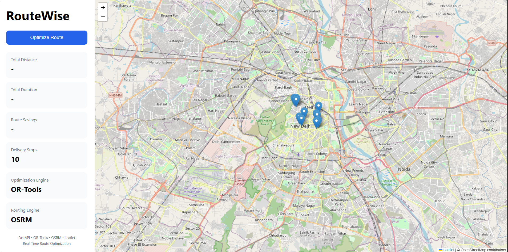
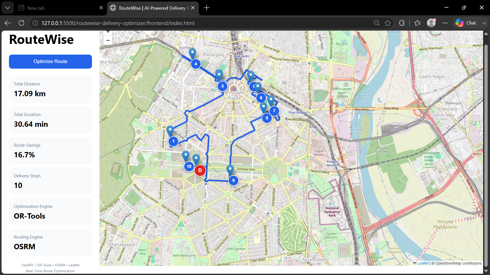
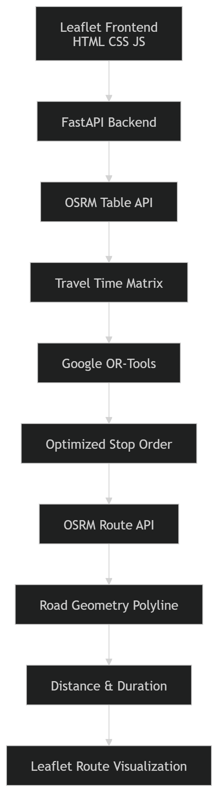

# 🚚 RouteWise – AI-Powered Multi-Stop Delivery Route Optimizer

<p align="center">
  
  
  
  
  
</p>

<p align="center">
  <b>Optimize delivery routes using real road-network travel times and Google's OR-Tools optimization engine.</b>
</p>

---

## 📌 Overview

RouteWise is a logistics route optimization platform that computes the fastest route for a driver with multiple delivery stops.

Unlike basic mapping tools that rely on straight-line distances, RouteWise uses:

- Real road network travel times
- Google OR-Tools optimization
- OSRM routing engine
- FastAPI backend
- Interactive Leaflet maps

The system determines the most efficient stop sequence and visualizes the optimized route on a map.

---

# ✨ Features

### 🚛 Multi-Stop Route Optimization

- Depot → Stops → Return Depot
- Up to 10+ delivery locations
- Optimized route sequencing

### 🧠 Google OR-Tools

Uses Google's Vehicle Routing Problem (VRP) solver to compute:

- Optimal stop order
- Reduced travel time
- Reduced travel distance

### 🌍 Real Road Routing

Uses OSRM APIs to generate:

- Travel time matrix
- Road network route geometry

### 🗺 Interactive Map Visualization

- Numbered stops
- Depot marker
- Optimized route polyline
- Real road routing

### ⚡ FastAPI Backend

- REST API architecture
- Request validation
- Modular backend design

---

# 📸 Dashboard



The dashboard displays:

- Total Distance
- Total Duration
- Delivery Stops
- Optimization Engine
- Interactive Route Map

---

# 🛣 Optimized Route



Features:

- Numbered delivery sequence
- Depot marker
- Optimized route path
- Real road network geometry

---

# 🏗 Architecture



### System Workflow

1. User clicks **Optimize Route**
2. Frontend sends coordinates to FastAPI
3. FastAPI requests travel-time matrix from OSRM
4. Google OR-Tools solves route optimization
5. Optimal stop order is generated
6. OSRM returns road geometry
7. Route is rendered on Leaflet

---

# 🎥 Demo


The demo shows:

- Route optimization
- Numbered stop generation
- Real-time map updates
- Distance and duration calculation

---

# 🧰 Tech Stack

| Layer | Technology |
|---------|------------|
| Frontend | HTML, CSS, JavaScript |
| Maps | Leaflet |
| Backend | FastAPI |
| Optimization | Google OR-Tools |
| Routing | OSRM |
| HTTP Client | HTTPX |
| Language | Python 3.12 |

---

# 📂 Project Structure

```text
routewise-delivery-optimizer
│
├── backend
│   ├── app
│   │   ├── api
│   │   ├── core
│   │   ├── models
│   │   └── services
│   └── requirements.txt
│
├── frontend
│   ├── index.html
│   ├── style.css
│   └── app.js
│
├── docs
│   ├── architecture.png
│   ├── dashboard.png
│   ├── optimized-route.png
│   └── demo.gif
│
└── README.md
```

---

# 🚀 Installation

## Clone Repository

```bash
git clone https://github.com/ShivamKapoor-py/routewise-delivery-optimizer.git

cd routewise-delivery-optimizer
```

---

## Backend Setup

```bash
cd backend

pip install -r requirements.txt
```

Create `.env`

```env
OSRM_BASE_URL=https://router.project-osrm.org
```

Run FastAPI:

```bash
uvicorn app.main:app --reload
```

Backend URL:

```text
http://127.0.0.1:8000
```

---

## Frontend Setup

Open:

```text
frontend/index.html
```

Using:

- VS Code Live Server
- Any local web server

Frontend URL:

```text
http://127.0.0.1:5500
```

---

# 📈 Sample API Response

```json
{
  "optimized_order": [0,1,3,2,4,5,6,7,8,9,10,0],
  "total_distance_km": 16.5,
  "total_duration_minutes": 24.45,
  "geometry": "polyline_string_here"
}
```

---

# 🎯 Real-World Applications

### Logistics

- Amazon
- FedEx
- UPS
- DHL

### Food Delivery

- Swiggy
- Zomato
- Uber Eats

### E-Commerce

- Last-mile delivery
- Fleet optimization
- Courier services

---

# 🔮 Future Enhancements

- Multiple vehicles
- Driver assignment
- Live traffic integration
- Delivery time windows
- GPS tracking
- Cloud deployment
- Real-time re-optimization

---

# 👨‍💻 Author

## Shivam Kapoor

Computer Science Engineering Student  
Bennett University

### GitHub

https://github.com/ShivamKapoor-py

### LinkedIn

https://www.linkedin.com/in/shivam-kapoor15/

---

# ⭐ Key Highlights

✅ FastAPI Backend

✅ Google OR-Tools Optimization

✅ OSRM Routing Engine

✅ Leaflet Interactive Maps

✅ Real Road Network Routing

✅ Multi-Stop Route Optimization

✅ Recruiter-Friendly Portfolio Project

---

If you found this project useful, consider giving it a ⭐ on GitHub.
